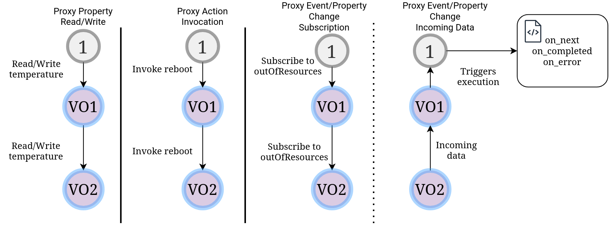

.. _voDescriptor:

VO/cVO Descriptors
==================

This page includes information about the VO/cVO Descriptor.

In the context of Nephele, we aim to utilize only the **(c)VO Descriptor** to configure (c)VOs.
The (c)VO Descriptor is a yaml file that represents all different options and mappings for a user-defined (c)VO.
The descriptor is parsed during instantiation time and handles the initialization of the Web of Things
runtime and the deployment of the Virtual Object itself.

A full example of a descriptor can be found in the ``examples/descriptors`` directory.

Descriptor fields
-----------------

An example is provided here:

.. code-block:: yaml

    # Name of the Virtual Object/Thing
    name: example_name
    # Type of the Virtual Object. Can be one of: VO/cVO
    type: cVO
    # Web of Things metadata
    resourceType:
        specification: WoT
        version: 1.1
    # Deployment Type. Can be one of: A, B
    # Deployment Type A means the associated device is running the WoT runtime
    # Deployment Type B means the associated device is not running the WoT runtime
    deploymentType: A
    # Catalogue port (port of an HTTP server) of the Thing from where it can be consumed
    catalogue: 9090
    # NorthBound interface of the Virtual Object
    bindingNB:
        # List of protocol servers that will be enabled for the NorthBound communication
        # Possible values: H (HTTP), M (MQTT), U(CoAP/UDP), WS(WebSocket)
        bindingModeNB: [H, M, U, WS]
        # The hostname that will be injected inside the forms used to access
        # the Virtual Object's Properties, Actions and Events
        hostname: example_hostname
        # Ports each server will be listening to. Possible keys: httpPort, coapPort
        ports:
            httpPort: 8080
            coapPort: 5683
        # The URL to reach the MQTT broker
        brokerIP: "mqtt://localhost:1883"
        # Path to a certificate to instantiate an HTTPS server
        serverCert: None
        # Path to a private key to instantiate an HTTPS server
        serverKey: None
        # Path to the certificate file of an MQTT NorthBound broker
        mqttCAFile: None
        # Path to a JSON Credentials Map for OSCORE (CoAP server)
        OSCORECredentialsMap: None
        # NorthBound security credentials definition
        securityNB:
            # The WoT security scheme that will be used. Can be one of: nosec, basic, bearer
            securityScheme: nosec
            # If `securityScheme` is set to basic, set the desired username-password
            username: example_username
            password: example_password
            # If `securityScheme` is set to bearer, set the desired token
            token: example_token
    # SouthBound interface of the Virtual Object
    bindingSB:
        # List of protocol clients that will be enabled for the SouthBound communication
        # Possible values: H (HTTP), M (MQTT), U(CoAP/UDP), WS(WebSocket)
        bindingModeSB: [H, M, U, WS]
        # Path to the certificate file of an MQTT SouthBound broker
        mqttCAFile: None
        # Path to a JSON Credentials Map for OSCORE (CoAP client)
        OSCORECredentialsMap: None
        # SouthBound security credentials definition that will be injected to
        # all requests made through the SouthBound interface
        securitySB:
            # HTTP credentials
            securitySBHTTP:
                # The WoT security scheme that will be used. Can be one of: nosec, basic, bearer
                securityScheme: nosec
                # If `securityScheme` is set to basic, set the desired username-password
                username: example_username
                password: example_password
                # If `securityScheme` is set to bearer, set the desired token
                token: example_token
            securitySBMQTT:
                # The WoT security scheme that will be used. Can be one of: nosec, basic
                securityScheme: nosec
                # If `securityScheme` is set to basic, set the desired username-password
                username: example_username
                password: example_password
            securitySBCOAP:
                # The WoT security scheme that will be used. Can be one of: nosec, basic, bearer
                securityScheme: nosec
                # If `securityScheme` is set to basic, set the desired username-password
                username: example_username
                password: example_password
                # If `securityScheme` is set to bearer, set the desired token
                token: example_token
    # Database configuration
    databaseConfig:
        # InfluxDB settings
        timeseriesDB:
            # Flag that enables/disables the InfluxDB connection. Can be one of: enabled,disabled
            influxDB: enabled
            # URL of where the InfluxDB is deployed
            address: "http://wotpy-influxdb-cvo:8086"
            # Username used to connect to the database
            dbUser: my-username
            # Password used to connect to the database
            dbPass: my-password
            # Token used from the VO to access the database
            dbToken: my-token
        # SQLite settings
        persistentDB:
            # Flag that enables/disables the SQLite database. Can be one of: enabled,disabled
            SQLite: enabled
            # Optional field that sets the path to save the database
            dbFilePath: None
    # List of generic functions that will be made available to the user-defined scripts.
    # Possible values: forecasting, mean_value, vo_status, device_status
    genericFunction: [forecasting, mean_value, vo_status, device_status]
    # User-defined functions that will be executed periodically
    # Is a map of function names and their periodicity in miliseconds
    periodicFunction:
        example_function: 0
    # Foreign Virtual Objects that will be consumed
    consumedVOs:
        # Name of the consumed VO
        example_vo_name:
            # Catalogue endpoint of the Virtual Object
            url: "http://vo1:9090/vo1"
            # List of events whose subscriptions need to be mapped to user-defined functions
            events:
            - exampleEvent
            # List of properties whose subscriptions to changes need to be mapped to user-defined functions
            propertyChanges:
            - exampleProperty
    # Proxy Properties, Actions and Events whose access is propagated to
    # other Virtual Objects and not handled locally
    proxy:
        # Map of property and the target Virtual Object
        propertiesMap:
            exampleProperty: example_vo_name
        # Map of action and the target Virtual Object
        actionsMap:
            exampleAction: example_vo_name
        # Map of event and the target Virtual Object
        eventsMap:
            exampleEvent: example_vo_name

Python script
-------------

As mentioned in the :ref:`tutorial`, the runtime requires a Python script that declares
the user-defined code that handles interactions with the Virtual Object. Apart from the ones
mentioned in the :ref:`tutorial` the additional ones are:

* **Periodic Functions:** snippets of code that need to run periodically
* **Subscriptions to remote Events or Property Changes:** snippets of code that need to run
  whenever an event is emitted or a property is changed on a remote Virtual Object that has
  been consumed
* **Proxy functions:** declaration of Properties, Actions or Events as proxies meaning that interaction
  with them is not handled locally but rather propagated to another Virtual Object

Periodic functions
~~~~~~~~~~~~~~~~~~

.. image:: images/periodic.png

The periodic functions section of the Virtual Object is a dictionary mapping the name of a python function
to a periodicity (in milliseconds).

Example:

- Virtual Object Descriptor:

    .. code:: yaml

        periodicFunction:
            read_property_from_device_1: 5000

- Python script:

    .. code:: python

        async def read_property_from_device_1():
            temperature = await consumed_vos["device1"].read_property("temperature")
            humidity = await consumed_vos["device1"].read_property("humidity")
            await exposed_thing.write_property("temperature", temperature)
            await exposed_thing.write_property("humidity", humidity)

The function ``read_property_from_device_1`` will run every 5 seconds.

Subscriptions to remote Events or Property Changes
~~~~~~~~~~~~~~~~~~~~~~~~~~~~~~~~~~~~~~~~~~~~~~~~~~

.. image:: images/remote_subscriptions.png

The ``events`` and ``propertyChanges`` section of the ``consumed_vos`` part of the Descriptor
let the runtime be aware of any remote events or property changes that need to be subscribed to.
The developer then needs to define the corresponding code in the python script.

Remote Events
"""""""""""""

Example:

- Virtual Object Descriptor:

    .. code:: yaml

        consumedVOs:
            vo2:
                url: "http://vo2:9090/vo2"
                events:
                - smokeDetected

- Python script:

    .. code:: python

        def smokeDetected_vo2_on_next(data):
            print(data)

        def smokeDetected_vo2_on_completed():
            print("Completed")

        def smokeDetected_vo2_on_error(err):
            print(err)

The Virtual Object subscribes to the ``smokeDetected`` event and the above functions
run each time new data is produced, the subscription finishes or an error occurs.

Remote Property Changes
"""""""""""""""""""""""

Example:

- Virtual Object Descriptor:

    .. code:: yaml

        consumedVOs:
            vo1:
                url: "http://vo1:9090/vo1"
                events:
                - temperature

- Python script:

    .. code:: python

        def temperature_vo1_on_next(data):
            print(data)

        def temperature_vo1_on_completed():
            print("Completed")

        def temperature_vo1_on_error(err):
            print(err)

Proxy functions
~~~~~~~~~~~~~~~

Proxy functions work by delegating operations on a Property, Action or Event to another Virtual Object.

Example:

    .. code:: yaml

        proxy:
            propertiesMap:
                temperature: vo1
            actionsMap:
                reboot: vo1
            eventsMap:
                outOfResources: vo1

Reads and writes on the local property ``temperature`` will be delegated to the ``vo1`` property ``temperature``,
action invocations for the local ``reboot`` action with their parameters will be delegated to ``vo1`` action
``reboot`` and the remote ``outOfResources`` event will be subscribed to, so that any data produced on the ``vo1`` will
be returned to the local subscribers as well.

.. warning::
    The target virtual object to which the connection will be made **must** be specified in the ``consumedVOs`` section.