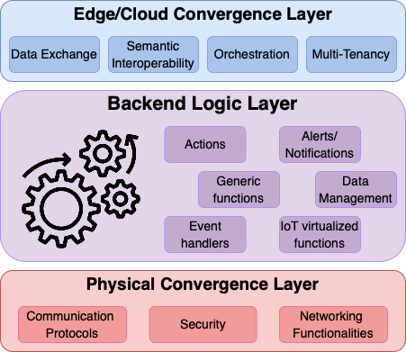

Virtual Object Introduction
===========================

Definitions
-----------
This section gives some basic definitions.

* A **Virtual Object (VO)** is considered as a virtual counterpart of a physical device on the Internet of Things domain. It provides a set of abstractions for managing any type of IoT device through a virtualized instance via multiple communication protocols, while augmenting the devices' functionalities through the development of a multi-layer software stack, called **Virtual Object Stack (VOStack)**.

* A **Composite Virtual Object (cVO)** is a software entity that is able to manage the information coming from one or multiple VOs and provide advanced functionalities. A cVO can be connected with one or multiple VOs that manage IoT devices of several types. The cVO interacts with the VOs, processes the collected information, and is able to contextually produce advanced knowledge, by enabling the communication and collaboration of several VOs, toward the production and exposure of a combined set of data outputs towards application graphs.

.. image:: images/vo_arch.png
    :scale: 60%
    :align: center

VO Architecture
----------------
This section explains the overall architecture of the Virtual Object.

* **Physical Convergence Layer**: This layer is responsible to tackle the major challenges of connecting the IoT devices with the computing continuum infrastructure.

* **Backend Logic Layer**: This layer is responsible for augmenting the functionalities and capabilities of IoT devices.

* **Edge/Cloud Convergence Layer**: This layer is responsible for bringing the VO closer to the application and orchestration layer.

VO alignment with W3C
---------------------
This section presents the alignment with the W3C Web of Things (`WoT <https://www.w3.org/WoT/>`__).

Based on the WoT `architecture <https://www.w3.org/TR/wot-architecture/>`__, a **Thing** is an abstraction of a physical or a virtual entity whose metadata and interfaces are described by a WoT **Thing Description** (TD). A TD describes the **Properties, Actions, and Events** and common metadata of the virtualized device.
Moreover, the **Exposed Thing** (ET) is a software abstraction that represents a locally hosted Thing that can be accessed over the network by remote Consumers.
Similarly, a **Consumed Thing** (CT) is a software abstraction that represents a remote Thing used by a local application.

In Nephele we consider **two** different types of deployments for the VOs according to the capabilities of the devices:

Device **with** computing capabilities
~~~~~~~~~~~~~~~~~~~~~~~~~~~~~~~~~~~~~~
In case of devices with some computing capabilities (e.g. drones, robots, raspberry Pis), we consider that the device can run a WoT runtime to communicate with the VO. As a result, the VO has both an ET and a CT to expose the virtualized device to cVOs or other Consumers.

.. image:: images/et_on_device.png

Device **without** computing capabilities
~~~~~~~~~~~~~~~~~~~~~~~~~~~~~~~~~~~~~~~~~
In case of limited resources we consider that the device directly communicates with the ET of the VO. To properly communicate with the VO's protocol servers, the user needs to consult the :ref:`protocols`.

.. image:: images/no_et_on_device.png

VO Technology stack
-------------------
This section explains the technology stack of the VO.

We are using (updating and expanding) the python implementation of the (`Python WoT <https://github.com/agmangas/wot-py/>`__).
In a nutshell, the proposed technology stack is comprised of the following basic functionalities:

1. **Protocol Bindings**: HTTP, MQTT, CoAP, WebSocket
2. **Security Protocols**: Basic, Bearer Token, OAuth2, TLS, OIDC4VP
3. **Storage**: SQLite, InfluxDB
4. **Generic Functions**: A set of functions to support the basic operations that the interplay between IoT and Applications require
5. **User-Defined Functions**: A set of functions to extend the functionalities of the (c)VOs which are contained to a python script
6. **(c)VO Descriptor**: A descriptor to summarize all necessary information for the (c)VO
7. **Automation Script Runner**: A script to configure the (c)VO according to the Descriptor
8. **Virtualization**: Helm Chart for ease of Deployment in Kubernetes

VO Development
--------------

A VO developer should provide a valid TD, a valid (c)VO descriptor and a valid python script with the User-Defined
Functions, to have a custom version of a VO. These components are then given as input to a script runner component/cli
that reads the Thing Description, the Virtual Object descriptor and the python script to configure the Virtual Object.
This more declarative approach of describing the Virtual Object was employed in order to minimize the boilerplate
code a developer needs to write. Additionally, this configuration process for the Virtual Object facilitates the
deployment in a virtualized environment such as Kubernetes.